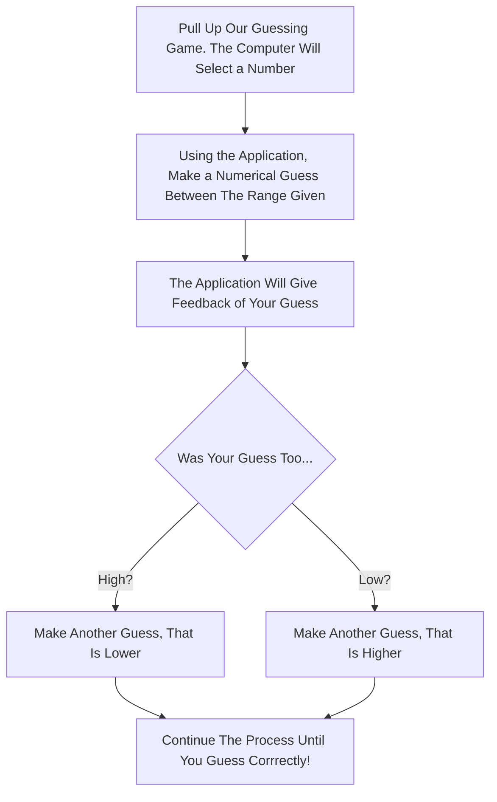

# isagar930.github.io
Isabella Garcia
isagar930@gmail.com / igarcia6@my.waketech.edu  
This is my school account, I will use this for my course assignments.
This account was made as part of the Lesson 01: Lab Assignment.

# About Me
## Background Information
I am 23 years old, born in New Hampshire but raised in Raleigh, North Carolina.  
I have played soccer since I was 4 years old.  
My family is Colombian. I have one older brother, who is 25 years old.  
My favorite food is pasta and my favorite drink is apple juice.  
My favorite animal is an elephant.  

## Recommended Websites
One of my favorite websites to visit when I'm bored, is [MapCrunch](https://www.mapcrunch.com/). This website navigates to random streets around the world and allows you to move around and explore the surroundings. You can discover new places around the world and get a closer look of life and views around the world.  
The website I visit most often is [Duolingo](https://www.duolingo.com/). Everyday, I log on to complete my lessons for the day as I learn French. Duolingo provides fun activities and different lessons to encourage learning a new language, including a leaderboard and streaks.

# Guessing Mermaid Diagram
In order to play our guessing game, there are a few steps to follow. Begin by pulling up our game. The computer will randomly select a number while you make your first numerical guess between the range given. The application will give you feedback and will let you know if your guess was too high, too low, or correct! If your guess was too low, that's okay! Proceed to make a second guess, aiming for a higher number this time. However, if your guess was too high, that's alright as well. Now, aiming for a lower number, make a second guess. Repeat this process until you guess the number correctly! Have fun playing!

